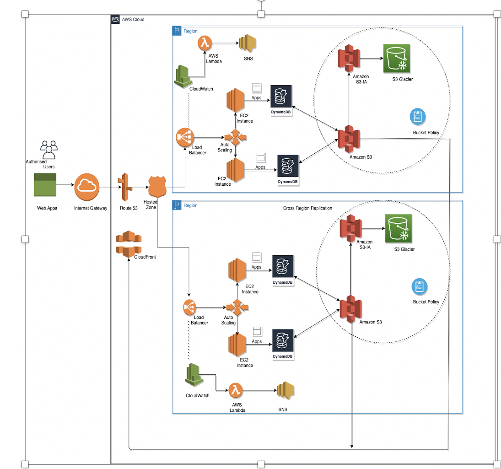
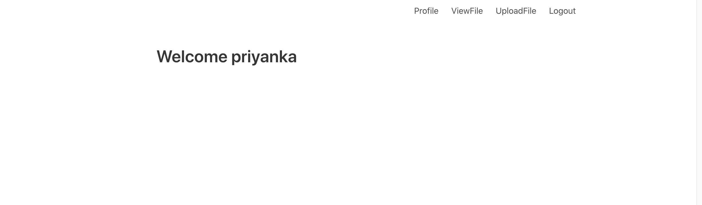
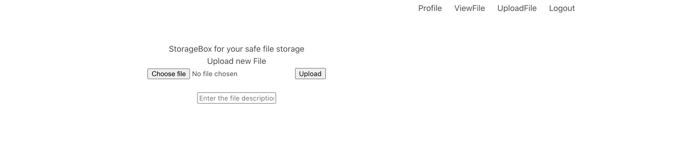

# StorageBox

Content:
The web application is designed for users to securely login and manage the file storage. Registered account user will be able to login, upload new files and also update, delete and edit the existing files.

Deployment:

•	Project is deployed Python 3.8 with flask, Users table in DynamoDB with Username (partition Key).

•	Another table in DynamoDB to save the file metadata with filename(partition key)

•	The files are stored in the S3 bucket with multi region availability. 

•	Create a virtual env based python 3.8

•	Install packages using requirement.txt

•	Run the application python application.py

•	Access the app on http://127.0.0.1:5000/

Architectural Diagram:

Home page:

Signup Page:

Login Page:

Profile page:

Upload Page:

Edit page:

Delete Page:

Features:

•	EC2: 
Helps us to deploy our application for the users to access/upload and download files. application.py file of the project is used to run the EC2 instance in the project.

•	S3: Will be used to upload the files created by the users. The files created will be stored under standard S3 bucket. 

•	S3 IA: A bucket policy is created to move the files greater than 75 days old to S3 IA

•	Amazon Glacier: The files which are greater than 365 days old are archived by moving it to the Glacier bucket. 

•	Dynamo DB
Is used to store the user profiled details

•	Route 53: 
Application IP address is resolved by Domain Name Server provided.

•	CloudFront: Helps in reducing the latency of the files when accessed.

•	Classic Load Balancer: Is used to distribute the load equally among the instance that is created. 

•	Autoscaling Group: Helps in autoscaling the load among the Ec2 instances created. 

•	CloudWatch: Helps us to create and events and logs to monitor and respond to events of the AWS resources and application. 

•	Lambda: Each time an EC instance is created or terminated a lambda function is created which invokes the SNS to send email notification.

•	SNS: Helps us to send mail to the configured user to provide notification.

